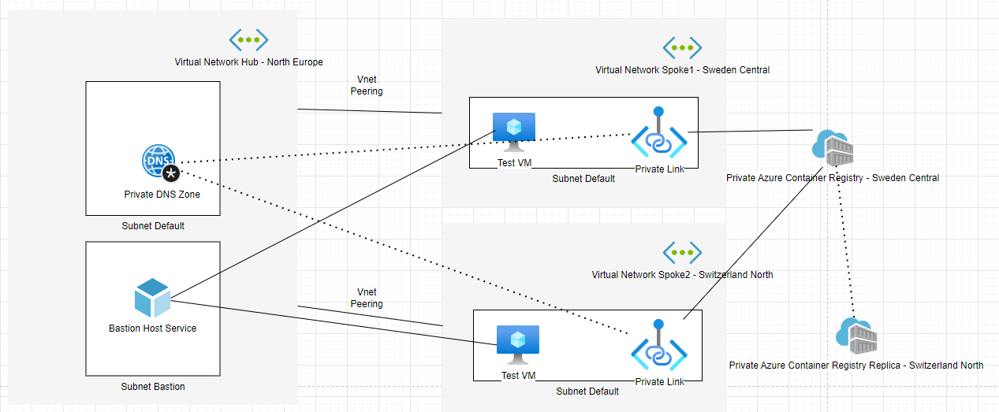

# terraform-acr-private-endpoints
Azure container registry with private access and geo-replication Terraform

This is not a module, it is intentionally under-engineered example how to Geo-replicate private Azure Container Registry.

It includes:
* Geo-replicated Azure Container Registry with Private Access
* Private DNS in Hub of Hub-Spoke network topology
* Private links from container registry to spokes

The trick is to prevent the private links to register themselves to the DNS (as one will overwrite the another) and rather register them in Terraform. This part is in dns.tf file.

It creates 2 VMs for testing, one for each spoke. This means it will cost something to deploy this (though the VMs are cheap SKUs with auto-shutdown policy). If you are unconfortable with this, just remove the terraform/vms.tf file.

## The network setup



## How to test that it works.

First apply the terraform. Note that you should change the variable acr_name_prefix or otherwise you will get a collision with somebody else (ACR names are global fqdn:s)

First upload a docker-image to the registry. You can use the Dockerfile on this project (docker-hello)

```az acr build --image sample/hello-world:v1  --registry myregistryname --file Dockerfile .```

You need to either run the command from spoke-network VM or set the registry network publicly available temporarily to do this from your local machine.

Once the image is there, you can do a docker-run on each spoke.

You can also ping the registries on spokes and see it returns different private IP for each spoke.

To check that the routing works so that each spoke connects to right data geo-replica is bit more complicated. 

Following assumes you pushed the hello-world image to ACR.

1. Create a refresh token using az-cli
```az acr login -n myregistryname --expose-token```
2. Use this token to generate a access-token:

```
curl --location --request POST 'https://myregistryname.azurecr.io/oauth2/token' \
--header 'Content-Type: application/x-www-form-urlencoded' \
--data-urlencode 'refresh_token=the-refresh-token-given-you-by-the-previous-command-which-is-very-long-string' \
--data-urlencode 'grant_type=refresh_token' \
--data-urlencode 'service=myregistryname.azurecr.io' \
--data-urlencode 'scope=repository:sample/hello-world:pull' 
```

3. Find out the digest of the container ```az acr manifest show -r myregistryname -n sample/hello-world:v1```

4. Use the digest from the layers part and access-token to find out the location of the layers data blob.

```
curl  --request GET 'https://myregistryname.azurecr.io/v2/sample/hello-world/blobs/sha256:digest-something-from-the-previous-command' \
--header 'Authorization: Bearer my-access-token'
```

This should give you a redirect to a blob storage (something like https://secreplica123.blob.core.windows.net/1b930d01...)

...which you could then trace from the VM in spoke to see whether it goes to right place at all :)
